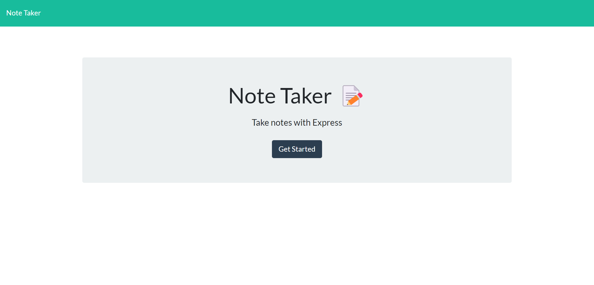
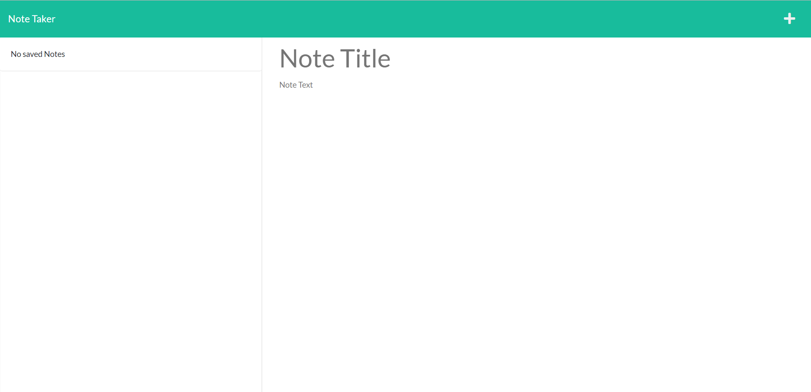
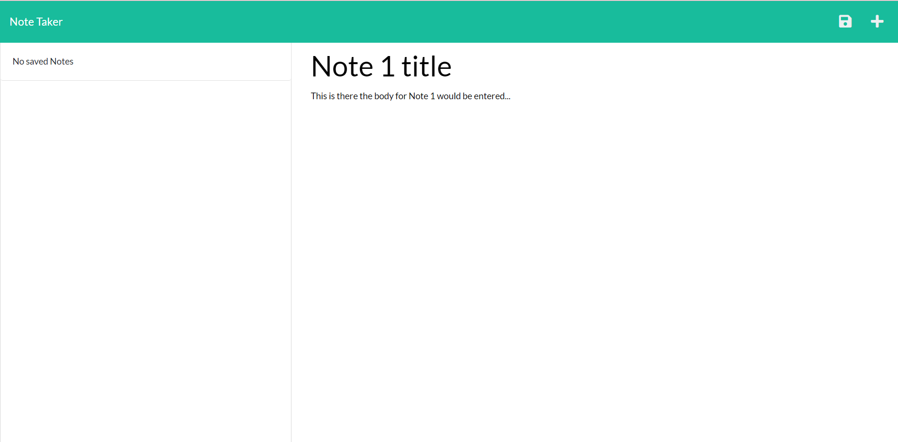

    
# note-taker-express

## Description

This is a note taking application that stores notes in a database using Express.js

## Usage 

After clicking on the "Get Started" button on the initial deployment page, an image like the above will appear. Simply click where it says "Note Title" or "Note Text" to edit the fields and click the save button in the upper right hand of the screen as shown below.

Notes will appear on the left side of the screen. Simply click the title of any note to edit it or click the delete button to remove a note.

## Deployed Application

Application can be found deployed on Heroku at:

https://peaceful-woodland-39556.herokuapp.com/